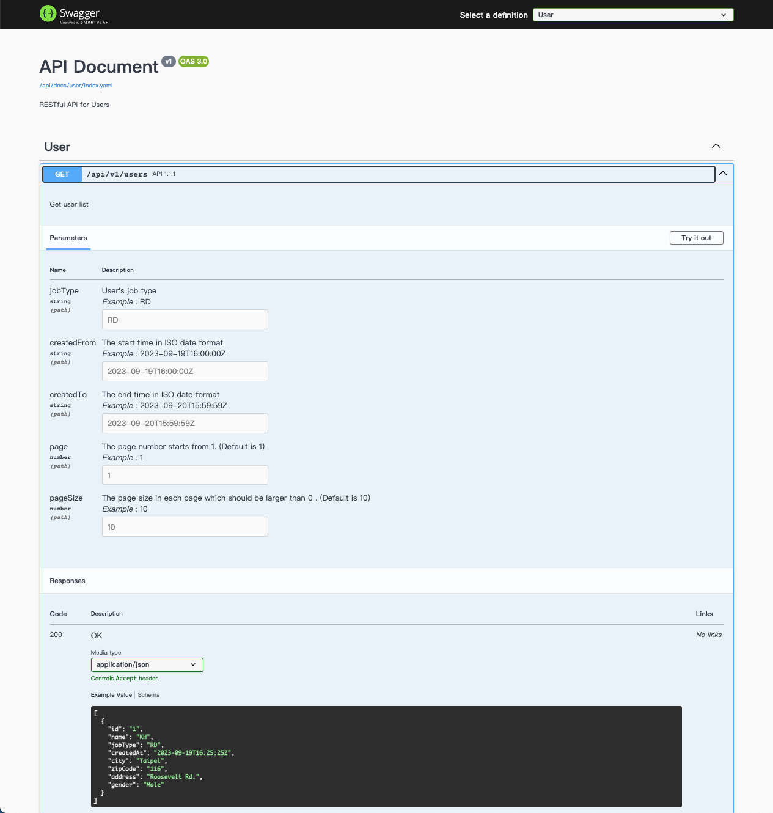
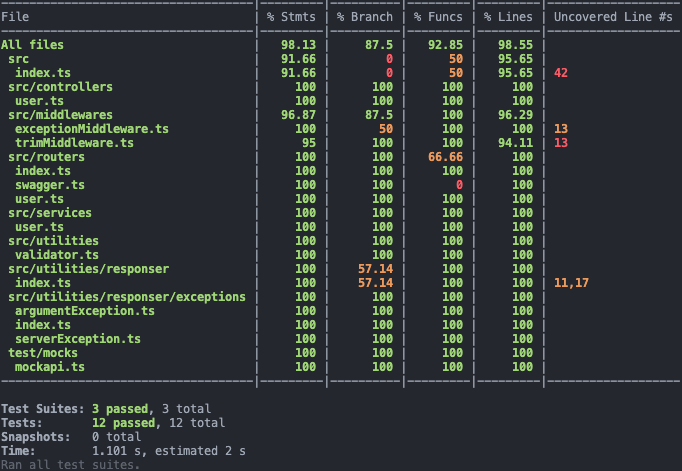

# MockAPI Demo

It's a Node.js Project which implements a user list API in `Koa2` and `Typescript`. This API is composed of two third-party APIs as following.
* Get All users
  https://64d5e658754d3e0f13614839.mockapi.io/api/users
* Get user detail data with user id
  https://64d5e658754d3e0f13614839.mockapi.io/api/user-detail/:id

## Swagger
A swagger document is supported in this project as shown in the following figure.

## Unit Test
This project uses `jest` and `supertest` to implement the unit test. The coverage rate is shown in the figure.

## How to Use
* Install packages: `npm i`
* Run testing: `npm test`
* Start service: `npm start`